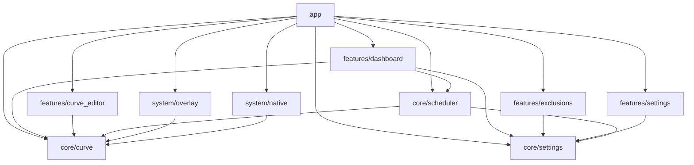
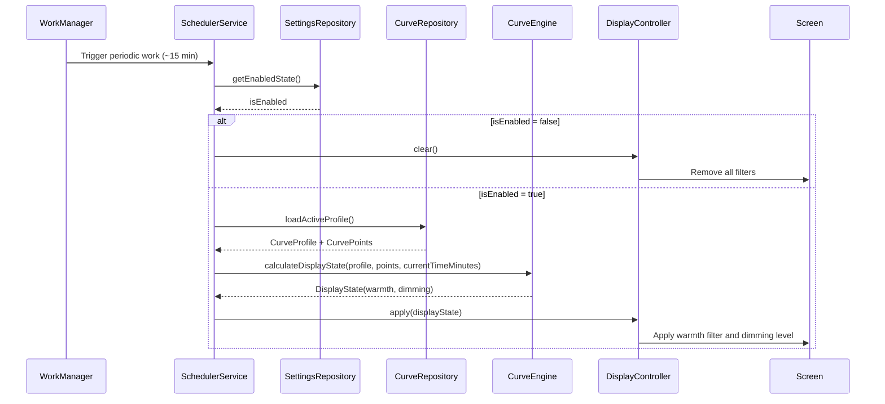

# Architecture

## Technology Stack

### Language
Kotlin — entire codebase. No Java.

### UI
Jetpack Compose — declarative UI only. No XML layouts.

### Architecture Pattern
MVVM (Model-View-ViewModel) with a structured `UiState` data class per screen and `StateFlow` for reactive state emission to the UI layer.
See [Decision 006](DECISIONS.md) for rationale over MVI.

### Dependency Injection
Hilt — compile-time validated dependency graph with native Android lifecycle awareness.
See [Decision 005](DECISIONS.md) for rationale over Koin and manual DI.

### Persistence
- **Room** — relational storage for `CurveProfile` and `CurvePoint` entities (one-to-many relationship).
- **Jetpack DataStore (Preferences)** — flat key-value storage for app-level settings (mode, enabled state, diagnostics). The active profile is tracked in Room via `CurveProfile.isActive`.

See [Decision 004](DECISIONS.md) for rationale.

### Background Tasks
WorkManager — periodic scheduling for display state evaluation (minimum 15-minute interval).
See [Decision 003](DECISIONS.md) for rationale over Foreground Services and AlarmManager.

---

## Module Structure

```
app/
core/
  curve/
  scheduler/
  settings/
features/
  dashboard/
  curve_editor/
  exclusions/
  settings/
system/
  overlay/
  native/
```

### Module Responsibilities

| Module | Responsibility |
|---|---|
| `app` | Application entry point. Wires all modules together via Hilt component modules. Contains no business logic. |
| `core/curve` | Pure domain logic. Defines `CurvePoint`, `CurveProfile`, `DisplayState`, `DisplayMode`. Houses `CurveEngine` and the `DisplayController` interface. **Zero Android framework dependencies.** |
| `core/scheduler` | `SchedulerService` and WorkManager Worker. Orchestrates curve evaluation and display state dispatch on a timed schedule. |
| `core/settings` | `AppSettings` and `ExclusionList` persistence via DataStore. Exposes repository interfaces consumed by features and the scheduler. |
| `features/dashboard` | Main screen ViewModel and Compose UI. Shows current status, active profile, and quick controls. |
| `features/curve_editor` | Curve editing ViewModel and Compose UI. Add, move, and delete curve points on a time-based graph. |
| `features/exclusions` | App exclusion list ViewModel and Compose UI. |
| `features/settings` | Settings screen ViewModel and Compose UI. Mode selection, permission management, and preferences. |
| `system/overlay` | `OverlayDisplayController`. Applies warmth and dimming via a full-screen software overlay using `WindowManager`. |
| `system/native` | `NativeDisplayController`. Applies warmth using Android-native display color APIs where the device supports them. |

---

## Module Dependency Graph

Enforced rules:
- `features/*` depend only on `core/*`. Never on `system/*` or on other feature modules.
- `system/*` depend only on `core/curve` (for the `DisplayController` interface and domain models).
- `core/scheduler` depends on `core/curve` and `core/settings`.
- `app` is the only module permitted to depend on all other modules. Its role is wiring, not logic.



---

## Data Flow

The following sequence describes a full scheduler evaluation cycle — from a WorkManager trigger to a physical screen change.



**Preview Mode** follows the identical path but substitutes `currentTimeMinutes` with a user-supplied virtual time value. The result is reflected in the UI layer only — the physical `DisplayController.apply()` call is bypassed during in-app simulation so the user's live screen is not affected while previewing.

**Immediate Trigger** — In addition to the periodic WorkManager schedule, `SchedulerService.triggerNow()` is called on:
- App launch
- Profile change
- Mode switch
- Master toggle change

This ensures the display state is always correct immediately, without waiting for the next scheduled cycle.

---

## Core Domain Models

### CurvePoint

A single node on a comfort curve.

| Property | Type | Description |
|---|---|---|
| `id` | `Long` | Primary key, auto-generated. |
| `profileId` | `Long` | Foreign key to parent `CurveProfile`. |
| `timeMinutes` | `Int` | Minutes since midnight. Range: `0–1439`. Example: `1320` = 22:00. |
| `warmth` | `Float` | Warmth level. Normalized: `0.0` = no color shift, `1.0` = maximum warm. |
| `dimming` | `Float` | Dimming level. Normalized: `0.0` = no dimming, `1.0` = maximum dim. |

**On `timeMinutes`:**
Representing time as an `Int` (minutes since midnight) was a deliberate choice:
- Trivially serializable to Room with no type converter needed.
- Naturally sortable and comparable with integer math.
- Completely timezone-agnostic — display adjustments are always evaluated against device local time. No UTC conversion is ever performed.
- Human-readable in logs (`timeMinutes=1320` is immediately recognizable as 22:00).

---

### CurveProfile

A named, ordered collection of CurvePoints representing a full adjustment schedule.

| Property | Type | Description |
|---|---|---|
| `id` | `Long` | Primary key, auto-generated. |
| `name` | `String` | User-defined display name. |
| `isActive` | `Boolean` | Whether this profile is currently selected. Only one profile may be active at a time. Enforced at the repository layer, not the database layer. |
| `createdAt` | `Long` | Unix timestamp (ms) of creation. Used for display ordering. |

---

### DisplayState

The computed output of `CurveEngine`. Represents the exact screen adjustment to apply at a given moment.

| Property | Type | Description |
|---|---|---|
| `warmth` | `Float` | Target warmth. Range: `0.0–1.0`. |
| `dimming` | `Float` | Target dimming. Range: `0.0–1.0`. |

**Note on `DisplayMode`:** The display mode (`NATIVE` vs `OVERLAY`) is **not** part of `DisplayState`. It is determined by the user's settings preference (`mode` DataStore key) and device capability (`isSupported()`), not by the curve engine. The `SchedulerService` reads the mode from `SettingsRepository` and selects the appropriate `DisplayController` implementation before calling `apply(displayState)`. This keeps `CurveEngine` purely concerned with interpolation — it has no knowledge of how the result will be applied to the screen.

---

### DisplayMode

```
NATIVE   — Use Android color display APIs (ColorDisplayManager, API 29+).
OVERLAY  — Use a full-screen software overlay via WindowManager.
```

---

## Core Services

### CurveEngine

**Location:** `core/curve`

**Responsibilities:**
- Accept a `CurveProfile` and a time value in minutes since midnight.
- Sort `CurvePoints` by `timeMinutes` before processing.
- Linearly interpolate `warmth` and `dimming` between the two nearest bounding points.
- Return a `DisplayState`.

**Edge cases — all must be explicitly handled and tested:**

| Scenario | Expected Behaviour |
|---|---|
| Empty profile (no points) | Return safe default: `DisplayState(warmth=0f, dimming=0f)` |
| Single point | Always return that point's values, regardless of current time |
| Time before first point | Clamp to first point's values |
| Time after last point | Clamp to last point's values |
| Time exactly on a point | Return that point's exact values (no interpolation needed) |
| Duplicate `timeMinutes` values | Sort first, use first occurrence, interpolate normally |
| Points provided out of order | Sort by `timeMinutes` ascending before any processing |
| Midnight wrap-around (last point > first point chronologically across midnight) | **Not interpolated** — clamps to the nearest endpoint. See [Decision 007](DECISIONS.md). |

**Important:** `CurveEngine` must be a pure Kotlin class with zero Android dependencies. It is the single most critical component in the codebase for correctness and must maintain 100% unit test coverage.

---

### SchedulerService

**Location:** `core/scheduler`

**Responsibilities:**
- Implemented as a `HiltWorker` registered with WorkManager as a `PeriodicWorkRequest` (~15-minute interval).
- On each execution: load the active profile, evaluate current local time against `CurveEngine`, dispatch result to `DisplayController`.
- On device reboot: re-enqueue itself via a `BroadcastReceiver` listening for `BOOT_COMPLETED`.
- Expose a `triggerNow()` method for immediate, on-demand evaluation outside the periodic cycle.

---

### DisplayController (Interface)

**Location:** `core/curve`

The contract that both display implementations satisfy. Defined in `core/curve` so `system/` modules can implement it without creating a dependency on `core/scheduler`.

```
interface DisplayController {
    fun apply(state: DisplayState)
    fun clear()
    fun isSupported(): Boolean
}
```

**Implementations:**

| Class | Module | Mechanism |
|---|---|---|
| `OverlayDisplayController` | `system/overlay` | Full-screen `WindowManager` overlay. Color and alpha mapped from warmth and dimming values. |
| `NativeDisplayController` | `system/native` | `ColorDisplayManager` (API 29+) for color temperature. Falls back gracefully on unsupported devices via `isSupported()`. |

The correct implementation is selected at runtime based on user preference (`DisplayMode`) and device capability (`isSupported()`). The `app` module provides the binding via a Hilt module.

---

## Persistence — DataStore Keys

| Key | Type | Default | Description |
|---|---|---|---|
| `mode` | `DisplayMode` | `OVERLAY` | Active display mode. |
| `isEnabled` | `Boolean` | `true` | Master on/off switch. |
| `lastEvaluatedAt` | `Long` | `0` | Unix timestamp (ms) of the last scheduler evaluation. Used for diagnostics. |

---

## Permissions

| Permission | Required For | Prompt Timing |
|---|---|---|
| `SYSTEM_ALERT_WINDOW` | Overlay Mode — drawing over other apps | On first launch, or when user switches to Overlay mode |
| `RECEIVE_BOOT_COMPLETED` | Restarting the scheduler after device reboot | Declared in manifest only — no runtime prompt |

**Battery Optimization:** The app should request exemption from battery optimization (`ACTION_REQUEST_IGNORE_BATTERY_OPTIMIZATIONS`) to prevent WorkManager task deferral on OEMs with aggressive power management (Samsung, Xiaomi, OnePlus). See [DEBUGGING.md](DEBUGGING.md) for OEM-specific notes.
